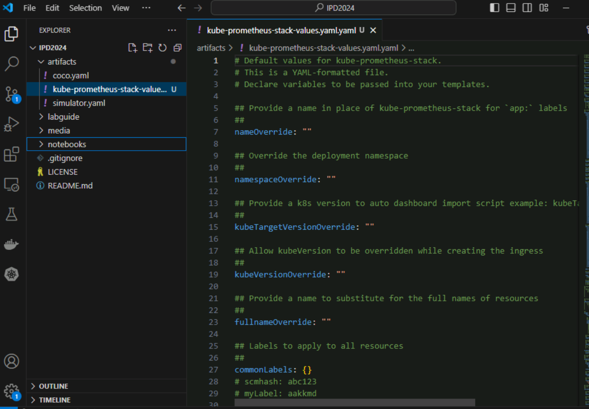
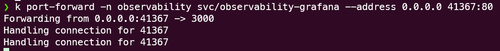
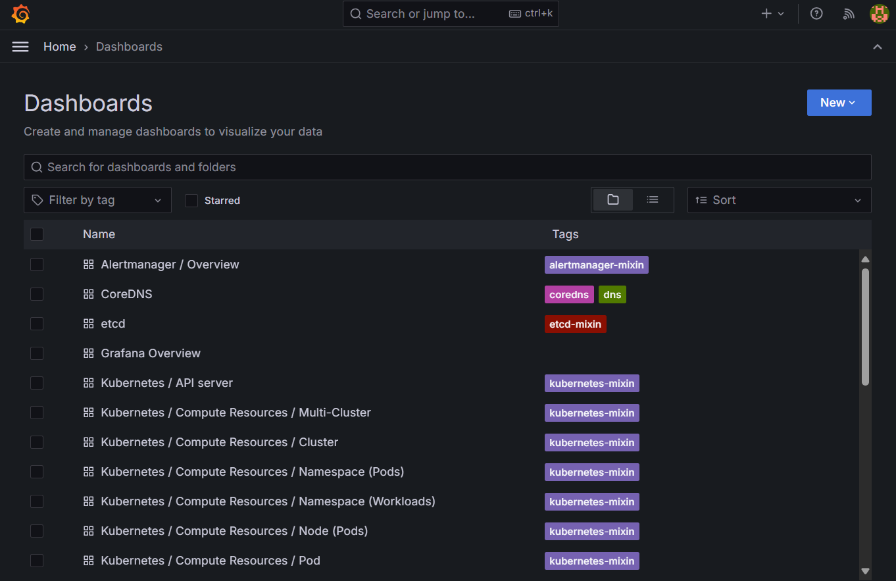
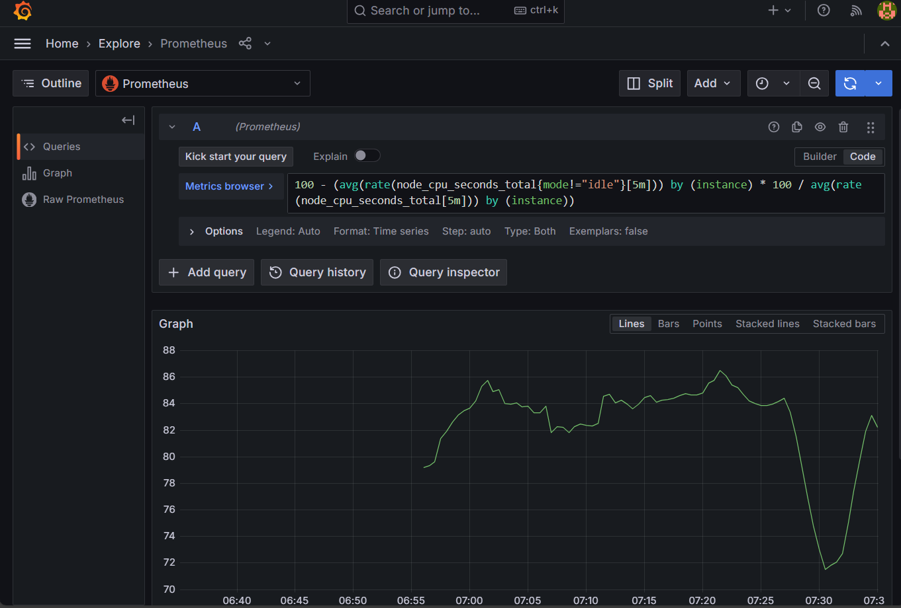
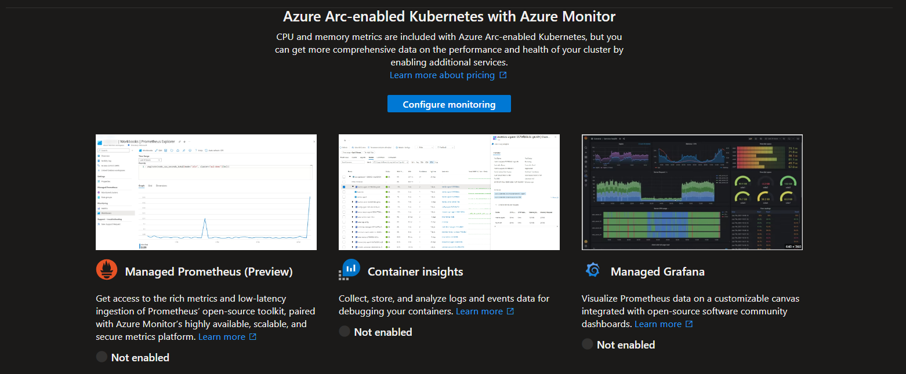
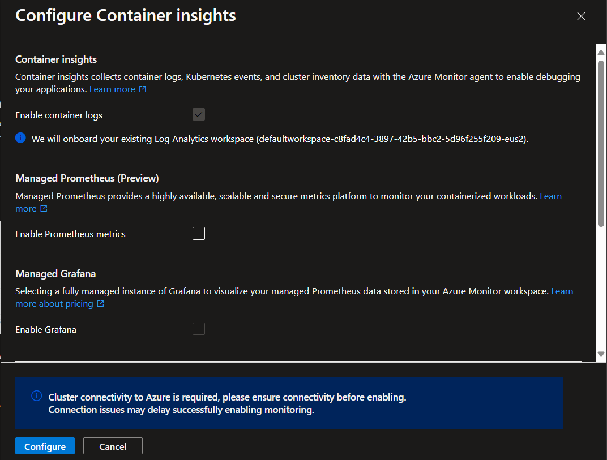

### Module 3.1 - Observability

Lab Scenario: Implementing Observability for Arc-enabled Kubernetes Clusters

In this lab, you'll explore how to observe the health and status of Arc-enabled Kubernetes clusters using Grafana and Azure Monitor. While there's overlap between these tools, this lab intends to show the core capabilities of both and discuss typical approaches used for monitoring.


## What do we mean by observability?

Observability in Kubernetes is crucial for maintaining the performance, reliability, and availability of applications. In industrial scenarios, this is crucial because the workloads being deployed are critical for worker safety, manufacturing, and a host of other reasons.  Knowing that a system is healthy or, conversely, knowing that a system is experiencing problems is key to operate Kubernetes cluster effectively and efficiently.

In addition, we can use observability tools to make data-driven decisions.  For example, how effective is a particular piece of equipment?  How much of a certain product are we producing?  

Step 1: Setting Up Grafana and Prometheus for On-Premises Monitoring

Prometheus is an open-source tool that collects and stores metrics from a variety of sources in real-time.  Grafana is an open-source data analytics and visualization tool.  In this lab, you will deploy Prometheus and Grafana within your on-premises Arc-enabled Kubernetes cluster. Grafana will be configured to collect and display metrics from Prometheus, a popular monitoring tool for Kubernetes.

>[!knowledge] While there is an Azure-native solution, known as [Azure Managed Grafana](https://learn.microsoft.com/en-us/azure/managed-grafana/overview), this lab focuses on self-hosting this solution.

Step 1. SSH into the Ubuntu k3s machine

First, SSH to the k3s machine Step 1 - Remote into the Ubuntu server using ssh.

    ssh 192.168.1.100

>[!help]The password is: @lab.VirtualMachine(UbuntuServer22.04).Password
>[!alert]The IP address of the Ubuntu server may be 192.168.1.101

Step 2. Install Prometheus and Grafana using Helm

A common way to install these tools is with Helm and the open-source [kube-prometheus-stack](https://github.com/prometheus-community/helm-charts/blob/main/charts/kube-prometheus-stack/README.md).  

```shell
helm repo add prometheus-community https://prometheus-community.github.io/helm-charts
helm repo update
```

There are *lots* of different ways to configure this.  Inside VSCode, open artifacts/kube-prometheus-stack-values.yaml.



Inside the values file, there are many different parameters that we could set.  For example, line 1019 lists a value of **adminPassword: prom-operator**.  If you wanted to change this or any of the other default parameters, we could modify the values file.

>[!tip]Refer to [this section](https://github.com/prometheus-community/helm-charts/blob/main/charts/kube-prometheus-stack/README.md#configuration) of the Helm repository to learn more about customizing this particular chart.

For this lab, you'll leave the default settings in the value file.

To actually deploy, type:

```shell
helm install observability  --namespace observability --create-namespace prometheus-community/kube-prometheus-stack
```


Verify that the pods are running with the following command:

```shell
kubectl --namespace observability get pods -l "release=observability"
```

The above command will show the pods that were created as part of the Helm chart you installed an their status.  After a short period of time, all pods should be ready.

Step 3. Familiarize yourself with Grafana

With the components necessary for Prometheus and Grafana running in your cluster, you'll need to temporarily expose the Grafana service outside the cluster.  In production, there are more robust ways to do this, like using an ingress controller; however, for the sake of simplicity, you'll run a port forwarding command to temporarily expose Grafana.

```shell
kubectl port-forward -n observability svc/observability-grafana --address 0.0.0.0 41367:80
```



This command exposes a specific service, **observability-grafana** so that it can be accessed outside the cluster on port 41367, which will be forwarded to port 80.  For more information on port forwarding, refer to the [Kubernetes documentation](https://kubernetes.io/docs/tasks/access-application-cluster/port-forward-access-application-cluster/) on the topic.

In your browser, go to 192.168.1.100:41367


[!help]The username is **admin** and the password is **prom-operator**

Login with the above credentials.  When you looked at the Helm values, you saw this default password.  While passwords should not typically be stored in Helm values files, this allows you to quickly get the observability stack running.

From the hamburger menu in the upper left, navigate to dashboards.



There are many pre-created dashboards already available.  Click on the dashboard entitled **Kubernetes / Compute Resources / Cluster**

This dashboard gives insight into the overall health of your Kubernetes cluster.  It's using prometheus and the underlying metrics it gets from [kube-state-metrics](https://github.com/kubernetes/kube-state-metrics) and [node exporter](https://github.com/prometheus/node_exporter).

>[!tip] spend a few minutes exploring this and other dashboards to see the types of information it presents

You can also explore the data through the use of [PromQL queries](https://prometheus.io/docs/prometheus/latest/querying/basics/).  For example, go to Home / Explore.  Change the query to use **code** and enter the following PromQL query (hit Shift+Enter to execute the query):

```
100 - (avg(rate(node_cpu_seconds_total{mode!="idle"}[5m])) by (instance) * 100 / avg(rate(node_cpu_seconds_total[5m])) by (instance))

```


This query calculates the percentage of CPU time spent in non-idle states and subtracts it from 100 to get the idle CPU percentage.  While outside the scope of this lab, writing your own queries will be useful if you instrument your own applications and want to use custom dashboards to view metrics.


## Using Azure Monitor for Cloud-Based Insights

Azure Monitor provides a comprehensive solution for collecting, analyzing, and acting on telemetry data from resources running directly in Azure as well as on-premises resources. For Arc-enabled Kubernetes clusters, Azure Monitor helps extend observability into the cloud, ensuring you have a centralized view of your cluster's health.

## Enabling Container Insights

To enable Container Insights for this Arc-enabled Kubernetes cluster, navigate to the Azure Portal and find the cluster yuo onboarded earlier.

Under the Monitoring blade, find **Insights**.  

.  Click on **Configure monitoring**

De-select **Enable Prometheus metrics** and **Enable Grafana** if checked.  Expand the Advanced Settings at the bottom of the dialogue to see the options you're presented with.  The data generated from Container Insights will be populated to the Log Analytics Workspace selected here.  In addition, note the various presets for Cost Presents.  Kubernetes generates significant amounts of data, so depending on your needs, you can alter the frequency of collection and filter the collection to only specific namespaces.

Leave the default settings and click **Configure**



TODO: show Insights metrics and graphs, etc.

By integrating Grafana for on-premises observability and Azure Monitor for cloud-based insights, you can ensure comprehensive observability of your Arc-enabled Kubernetes clusters. This dual approach provides flexibility and depth, allowing you to maintain high standards of performance and reliability across diverse environments.

### Module 3.2 - GitOps

### Module 3.3 - Secure the infrastructure

## **Congratulations, you have reached the end of this lab.**

- Call to action
- Other sessions
- Jumpstart linksi